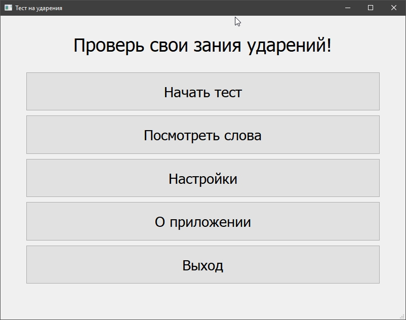
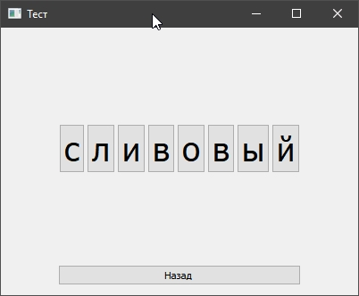
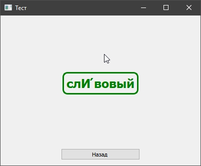
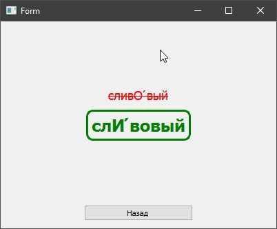
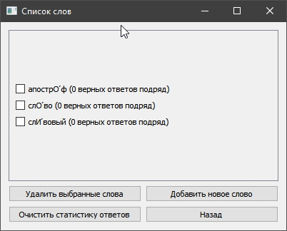
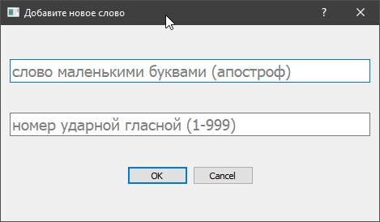
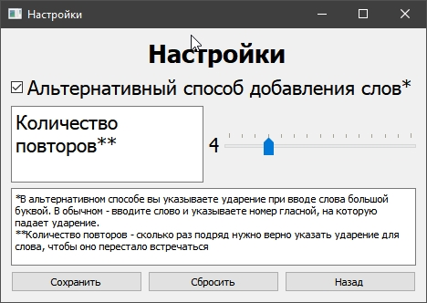
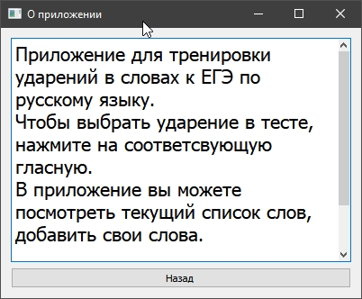

# AccentTest2.0
After reading the book "Clean Code: A Handbook of Agile Software Craftsmanship", I am rewriting my old application

I use Qt Creator 4.11.1

App screenshots:

* Main menu 
    
    ​

* Accent test example 
    
    ​

* Right and wrong answers 
    
    ​ 
    
    ​

* Words list and statistic 

    ​

* New words adding
    * regular form 
    
        ​
    * alternative form 
    
        ​

* App settings 
    
    ​
    
* About app 

    ​