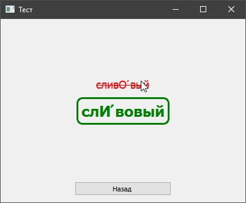

# AccentTest2.0
After reading the book "Clean Code: A Handbook of Agile Software Craftsmanship", I am rewriting my old application

I use Qt Creator 4.11.1

Main menu:
​

Test example:

​

Right and wrong answers:

​
​

Words list and statistic:

​

New words adding:

​